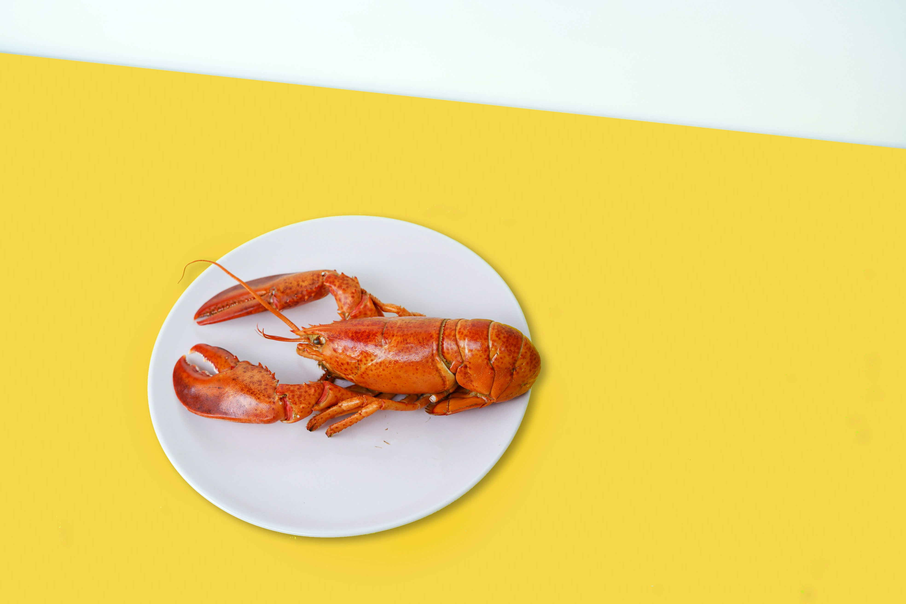

```{css, echo=FALSE}
body {
  font-family: 'Verdana', sans-serif;
  display: flex;
  font-size: 1.7em;
  flex-direction: column;
  height: 100vh; /* Full height of the viewport */
  justify-content: center; /* Center vertically */
  align-items: center; /* Center horizontally */
}

#footer {
position: fixed;
left: 0;
bottom: 0;
width: 100%;
background-color: #f2f2f2; /* You can change the background color */
  color: black; /* Text color */
  text-align: center;
padding: 10px 0;
font-size: 0.9em;
}


```

------------------------------------------------------------------------

------------------------------------------------------------------------



<br>

### [*Click to view the analysis*](https://business-analytics-slee.shinyapps.io/Data_Models_Decisions_Chapter_1_kendall_crab_lobster/)

<br>

## **Take a quick glance of this case study and analysis.**

<br>

**What kind of problem are we solving, what is the story?** <br>

We are tackling a decision analysis problem to determine the best course of action for Jeff Daniels, the director of Overnight Delivery Operations at Kendall Crab and Lobster, Inc. (KCL), in response to an approaching storm that could potentially shut down Boston’s Logan International Airport. The story revolves around Jeff’s need to decide whether to proactively arrange alternative transportation for the lobsters via truck delivery or wait to see if the storm actually impacts airport operations, risking potential delays or cancellations that could affect KCL’s profitable overnight delivery business. <br>

**What is the goal of the analysis?** <br>

The goal is to construct and analyze a decision tree that maps out Jeff’s options and the associated uncertainties regarding the storm's impact on airport operations. This analysis will guide Jeff in selecting the optimal strategy that balances cost efficiency with maintaining reliable customer service, ensuring minimal disruption to KCL’s overnight delivery operations.<br><br>

<br>

------------------------------------------------------------------------

------------------------------------------------------------------------

::: {#footer}
```{r echo=FALSE, results='asis'}
cat("Copyright © 2023-", format(Sys.Date(), "%Y"), "Sangho Lee, All rights reserved.")
```
:::
