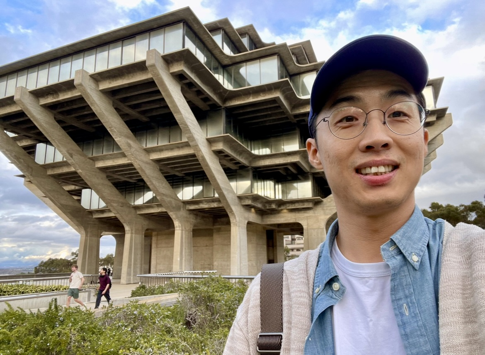
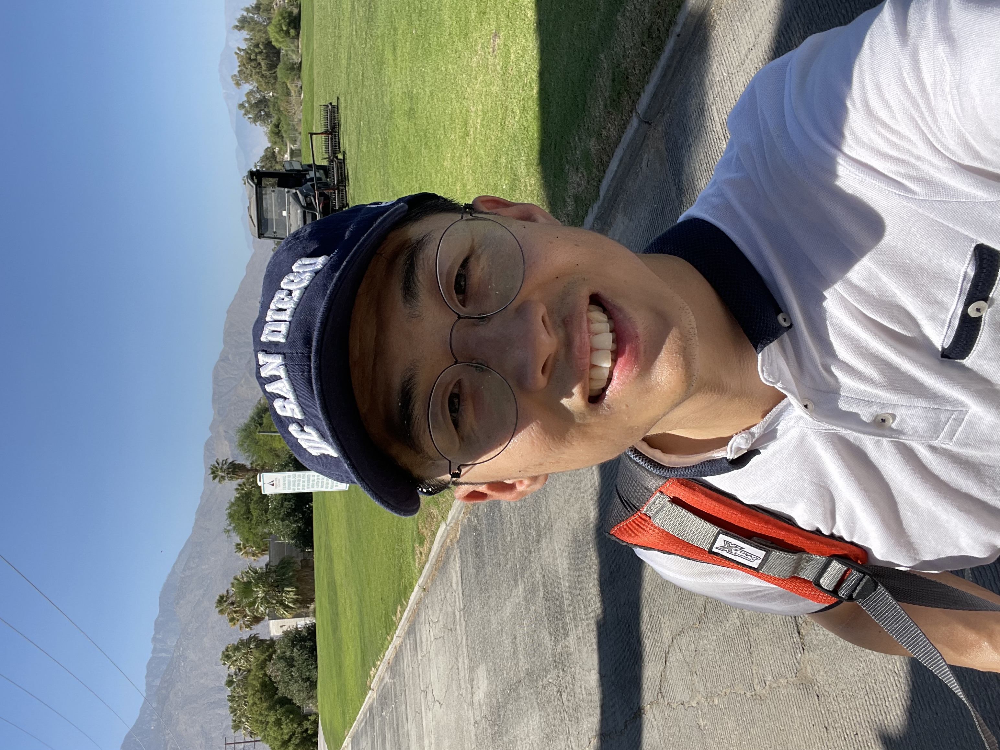
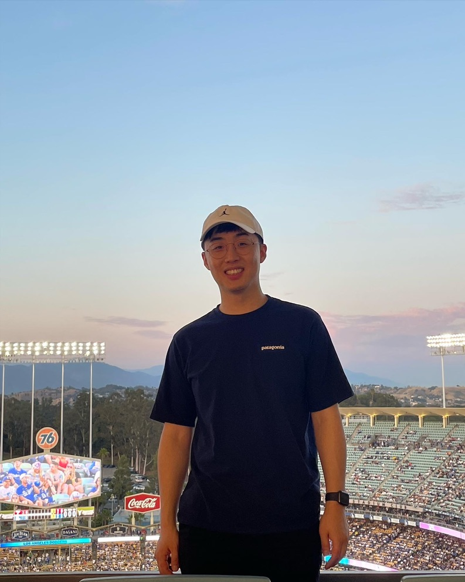
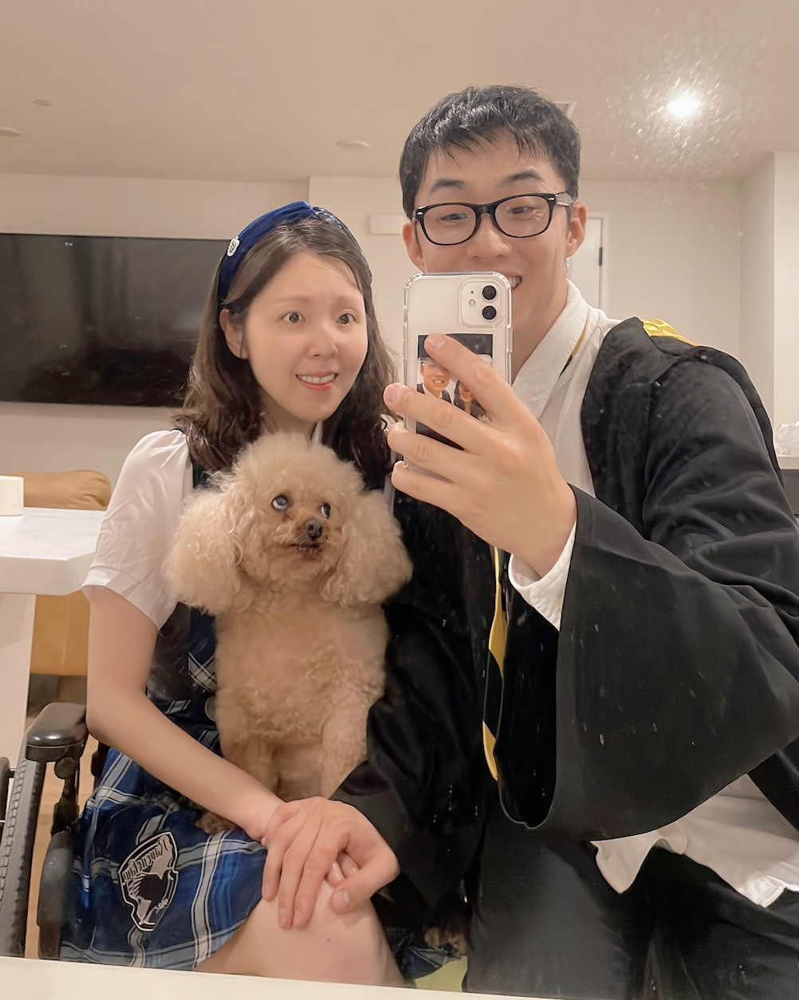

```{css, echo=FALSE}
body {
  font-family: 'Verdana', sans-serif;
  display: flex;
  flex-direction: column;
  justify-content: center; /* Center vertically */
  align-items: center; /* Center horizontally */
}

#footer {
position: fixed;
left: 0;
bottom: 0;
width: 100%;
background-color: #f2f2f2; /* You can change the background color */
  color: black; /* Text color */
  text-align: center;
padding: 10px 0;
font-size: 0.9em;
}


```

------------------------------------------------------------------------

------------------------------------------------------------------------

Hello! I'm Sangho Lee, a dedicated data analyst at Ventura Foods where I am currently enhancing business processes at Ventura Foods and a bit of an R & Python enthusiast.

{width="306"}

<br><br> My data journey didn't start in a classroom; it began hands-on, with lots of coding and real-world problem-solving. Keen to dive deeper, I headed to UC San Diego for a Master's in Business Analytics, which turned out to be a fantastic playground for my data-driven curiosity.

At Ventura Foods, my day-to-day is all about making things easier and more insightful through automation and dashboards, thanks to the magic of R and R Shiny. I believe in the power of data to tell stories and guide decisions, and I love turning complex data into clear, actionable insights.

This website? It's my digital sandbox. Inspired by "Data, Models, and Decisions" by Dimitris Bertsimas and Robert M. Freund, it's where I unpack case studies using R and Python, hoping to spark conversations and share a-ha moments about data and decisions in the business world.

<br><br>When I'm not crunching numbers or codings, you'll likely find me on the golf course or cheering for the LA Dodgers. Golf is my way to unwind -- there's nothing like the peace of hitting the fairways, and every round is a new adventure. It's my mini-vacation from the daily grind.

Speaking of excitement, I'm a huge baseball fan, especially of the LA Dodgers. My first game at Dodger Stadium was an unforgettable experience -- the energy, the fans, and that unforgettable feeling of being part of something bigger. It's been a thrill ride ever since! 🏌️⚾

{width="164"}. {width="175"}

<br> <br>

Back at home in Irvine, California, with two of my greatest joys: my adorable miniature poodle, Brownie, and my wonderful wife, Kristen. Our days are brightened by Brownie, the undisputed little boss of our home. She's a bundle of enthusiasm, always on a quest for treats and seeking out the coziest napping spots. Her playful antics and affectionate nature bring a smile to every moment.

Living in Irvine offers its own charms. Whether we're soaking up the California sun, exploring local hidden gems (So many good foods in OC!), or simply enjoying a quiet day at home, every day is an adventure, though my wife and I also love to stay at home for as many as days we can 😂.

<br>

{width="209"}

<br><br>I hope you enjoy the websites and also Feel free to visit my <a href="https://www.linkedin.com/in/slee1211" target="_blank">LinkedIn</a>, or check out what I'm up to on <a href="https://www.github.com/slee8495" target="_blank">GitHub</a>.

Also, check out this fun project that I've done with my study buddies

<a href="https://ucsd-rsm.shinyapps.io/mgta452_group_c/" target="_blank">US Census Data Project (UCSD)</a>

<br>
<br>
Enjoy your visit!

------------------------------------------------------------------------

------------------------------------------------------------------------

::: {#footer}
```{r echo=FALSE, results='asis'}
cat("Copyright © 2023-", format(Sys.Date(), "%Y"), "Sangho Lee, All rights reserved.")
```
:::
