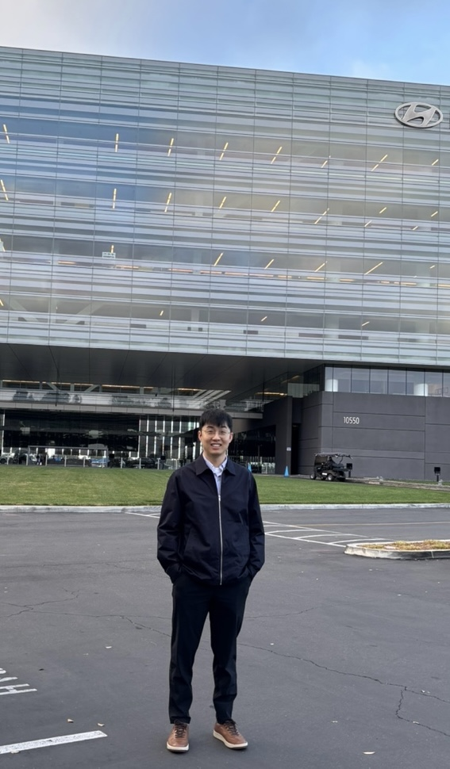

```{css, echo=FALSE}
body {
  font-family: 'Verdana', sans-serif;
  display: flex;
  flex-direction: column;
  justify-content: center; /* Center vertically */
  align-items: center; /* Center horizontally */
}

#footer {
position: fixed;
left: 0;
bottom: 0;
width: 100%;
background-color: #f2f2f2; /* You can change the background color */
  color: black; /* Text color */
  text-align: center;
padding: 10px 0;
font-size: 0.9em;
}


```

------------------------------------------------------------------------

------------------------------------------------------------------------

Hi, I’m Sangho Lee, a data-driven problem solver and Manager of Analytics & Performance Optimization at Hyundai Motors America. My passion lies in transforming raw data into meaningful insights that drive strategic decision-making and operational efficiency.

<br>



<br> I didn’t start my career in a classroom—I started hands-on, tackling real-world problems through coding, analytics, and automation. This passion led me to pursue a Master’s in Business Analytics at UC San Diego, where I deepened my expertise in statistical modeling, machine learning, and business intelligence.

<br>

{width="653"}

<br><br>

This site is an extension of my passion for analytics—a space where I document my study notes, industry insights, and personal interpretations of data-driven decision-making. While inspired by Data, Models, and Decisions by Dimitris Bertsimas and Robert M. Freund, it goes beyond the book, incorporating my own experiences and real-world applications.

My goal is to make analytics engaging, insightful, and practical, breaking down complex concepts into actionable takeaways.

<br>

When I’m not working with data, I enjoy watching baseball (Go Dodgers!), football (Go Rams!), and binge-watching Netflix. At home in Orange County, California, I spend time with my wife, Kristen, and our little baby, Brownie. We love discovering great food spots in Southern California, but also enjoy quiet days at home.

<br>

{width="698"}

<br><br>I hope you enjoy the websites and also feel free to visit my <a href="https://www.linkedin.com/in/slee1211" target="_blank">LinkedIn</a>, or check out what I'm up to on <a href="https://www.github.com/slee8495" target="_blank">GitHub</a>.

<br> <br> Enjoy your visit!

<br> <br>

------------------------------------------------------------------------

------------------------------------------------------------------------

::: {#footer}
```{r echo=FALSE, results='asis'}
cat("Copyright © 2023-", format(Sys.Date(), "%Y"), "Sangho Lee, All rights reserved.")
```
:::
