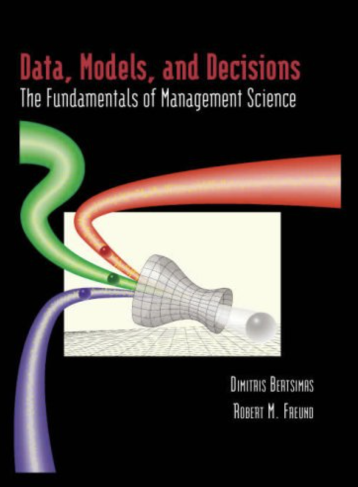

```{css, echo=FALSE}
body {
  font-family: 'Verdana', sans-serif;
  display: flex;
  flex-direction: column;
  justify-content: center; /* Center vertically */
  align-items: center; /* Center horizontally */
}

#footer {
position: fixed;
left: 0;
bottom: 0;
width: 100%;
background-color: #f2f2f2; /* You can change the background color */
  color: black; /* Text color */
  text-align: center;
padding: 10px 0;
font-size: 0.9em;
}


```

------------------------------------------------------------------------

------------------------------------------------------------------------


{width="340"}

<br><br>
This is the book called "Data, Models, and Decisions" by Dimitris Bertsimas and Robert M. Freund which I will cover the case studies throughout in ths website. This book has significantly fueled my understanding of analytics, particularly in its fundamental aspects, ever since I discovered it during my studies at UC San Diego. In my opinion, it offers a different perspective on analytics, more engaging than what you'd typically expect from a textbook.

The book covers a variety of topics, starting with decision trees. These are tools that help you systematically think through choices and their potential outcomes. It's a practical approach to decision-making. Then, it moves into probability and statistics, laying a solid foundation for understanding data.

What's really useful about this book is how it connects theory with real-world applications. For instance, it discusses simulation modeling, which is all about anticipating and planning for different business scenarios. Regression modeling is another area it covers, teaching you how to interpret and use data to uncover trends and relationships.

Linear optimization is also a significant topic in the book. This part focuses on solving complex problems in efficient ways, a crucial skill in analytics.

One of the strengths of this book is its use of case studies. These aren't just hypothetical situations; they're based on real business challenges and show how data, models, and decision-making intersect in practical settings.

Overall, "Data, Models, and Decisions" is a solid resource for those interested in business analytics. It's a book I've found useful and return to occasionally for insights and reference.

If you're interested in the practicalities of data and decision-making, this book might offer you some valuable perspectives. I'll be sharing case studies and insights from it here!


------------------------------------------------------------------------

------------------------------------------------------------------------


::: {#footer}
```{r echo=FALSE, results='asis'}
cat("Copyright © 2023-", format(Sys.Date(), "%Y"), "Sangho Lee, All rights reserved.")
```
:::

