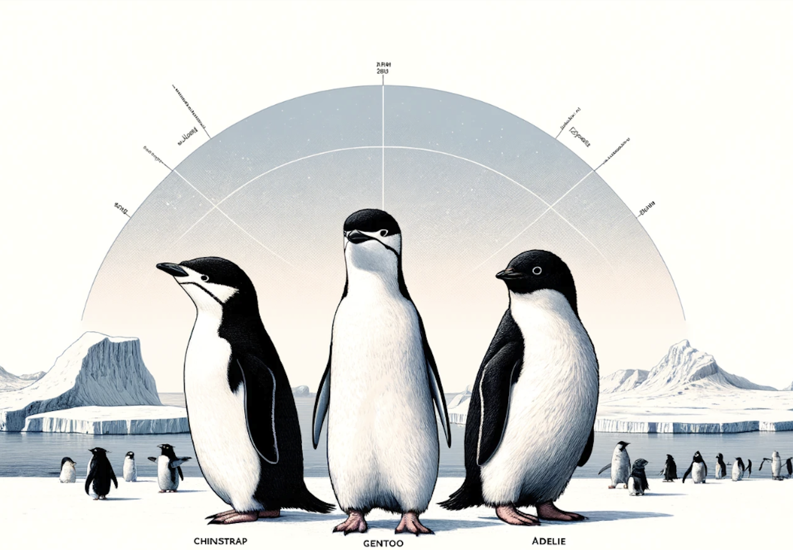

```{css, echo=FALSE}
body {
  font-family: 'Verdana', sans-serif;
  display: flex;
  font-size: 1.7em;
  flex-direction: column;
  height: 100vh; /* Full height of the viewport */
  justify-content: center; /* Center vertically */
  align-items: center; /* Center horizontally */
}

#footer {
position: fixed;
left: 0;
bottom: 0;
width: 100%;
background-color: #f2f2f2; /* You can change the background color */
  color: black; /* Text color */
  text-align: center;
padding: 10px 0;
font-size: 0.9em;
}


```

------------------------------------------------------------------------

------------------------------------------------------------------------



<br>

### [*Click to view the analysis*](https://business-analytics-slee.shinyapps.io/data_models_decisions_marketing_segmentation/)

<br>

## **Take a quick glance of this case study and analysis.**

<br>

**What kind of problem are we solving, what is the story?** <br>

-   We aim to segment the different species of penguins in the Palmer Penguins dataset by analyzing various features such as bill length, bill depth, flipper length, and body mass. This involves determining distinct clusters within the dataset that group similar penguin species together. This study forms part of a project for the UC San Diego, MSBA program; MGTA 495 - Marketing Analytics course. You can see other segmentation using K-means in Supply Chain Analysis: Late Order Acknowledgement project as well. <br>

**What is the goal of the analysis?** <br>

-   The goal is to write the k-means clustering algorithm, visualize its steps, and compare the results with the built-in k-means function in R. Additionally, we aim to calculate and plot the within-cluster-sum-of-squares and silhouette scores for different numbers of clusters to determine the optimal number of clusters suggested by these metrics.

## <br>

------------------------------------------------------------------------

::: {#footer}
```{r echo=FALSE, results='asis'}
cat("Copyright © 2023-", format(Sys.Date(), "%Y"), "Sangho Lee, All rights reserved.")
```
:::
